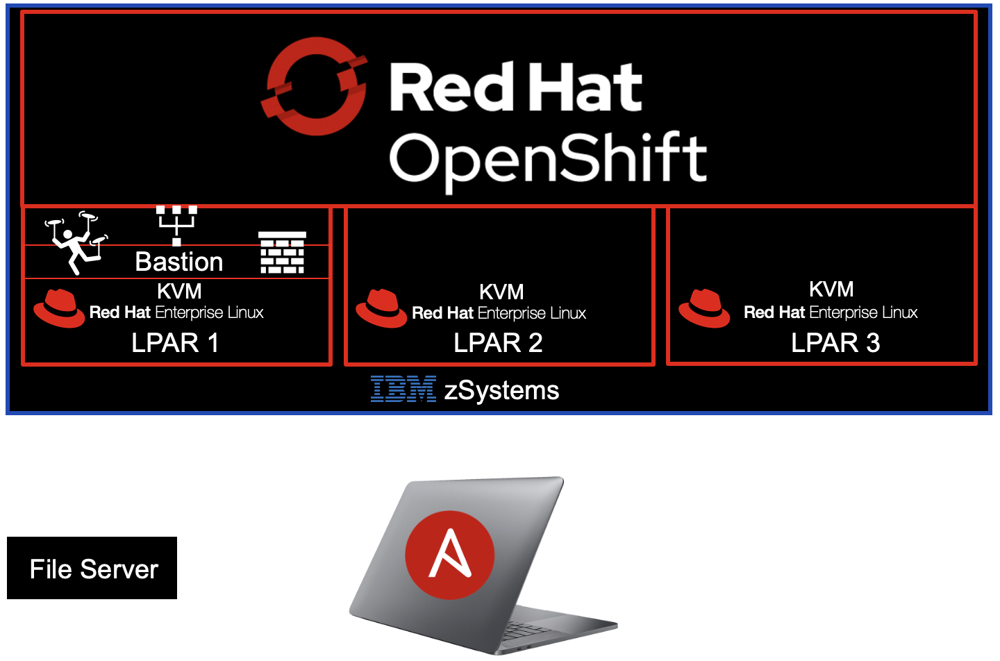

# Ansible-Automated OpenShift Provisioning on KVM on IBM zSystems / LinuxONE
## Overview
These Ansible Playbooks automate the setup and deployment of a Red Hat OpenShift Container Platform (RHOCP) cluster on IBM zSystems / LinuxONE with Kernel Virtual Machine (KVM) as the hypervisor.  

## Ready to Start?
Use the left-hand panel to navigate the site. Start with the [Before You Begin](before-you-begin.md) page.
## Need Help?
Contact Jacob Emery at jacob.emery@ibm.com