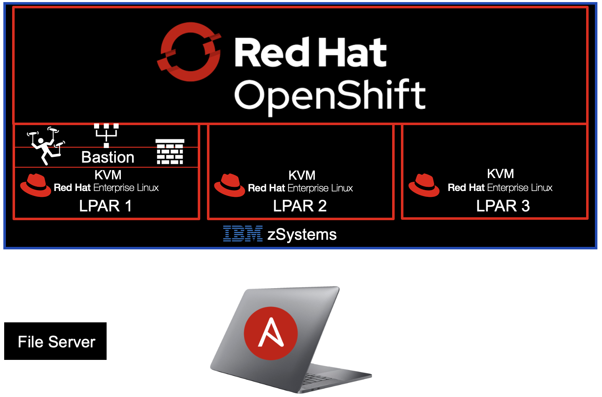

# Ansible-Automated OpenShift Provisioning on IBM zSystems / LinuxONE
## Overview
These Ansible Playbooks automate the setup and deployment of Red Hat OpenShift Container Platform (RHOCP) clusters on IBM zSystems / LinuxONE across multiple hypervisors and installation methods.
## Supported Configurations
| Hypervisor | Installation Methods |
|------------|---------------------|
| **KVM** | UPI, Agent-Based Installer (ABI), Hosted Control Plane (HCP) |
| **LPAR** | UPI, Agent-Based Installer (ABI), Hosted Control Plane (HCP) |
| **z/VM** | UPI, Hosted Control Plane (HCP) |

## Ready to Start?
Use the left-hand panel to navigate the site. Start with the [Before You Begin](before-you-begin.md) page.
## Need Help?
Contact Amadeus Podvratnik at pod@de.ibm.com
